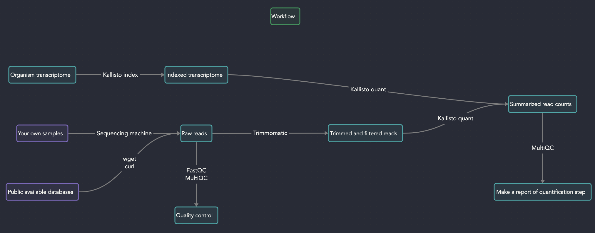

# From raw reads to expression table
This file has been written on 18th October 2023. Maybe it is not update or functional anymore.

## 0. Workflow



## 1. Introduction

This pipeline is made via [Snakemake](https://snakemake.readthedocs.io/en/stable/), workflow management system, which is a tool to create reproducible and scalable data analyses. The idea is to leverage the available infrastructure and make the analyses faster, scalable and reproducible. I highly recommend to familiarize yourself via [snakemake](https://snakemake.readthedocs.io/en/stable/tutorial/tutorial.html), [UNIX](https://swcarpentry.github.io/shell-novice/), [fastqc](https://www.bioinformatics.babraham.ac.uk/projects/fastqc/), [trimmomatic](https://github.com/usadellab/Trimmomatic), [kallisto](https://pachterlab.github.io/kallisto/) and [multiqc](https://multiqc.info/) before using this pipeline. I also suggest to read [this](https://rnabio.org/module-09-appendix/0009/12/01/StrandSettings/) and [this](https://littlebitofdata.com/en/2017/08/strandness_in_rnaseq/) about strandness.

## 2. Setup

You are free to set up your system the way you like. I highly recommend the one below.

First, install mamba.
```
conda create -n snakemake -c conda-forge mamba
```
And then, use mamba to install snakemake:
```
mamba install -c conda-forge -c bioconda snakemake
```
The rest will be installed and managed via `Snakemake` and controlled using files inside `envs` folders. You do not have to do anything, but you can change the version, if you want.

**Note**: In different files, I refer to a setting called `scratch` in my codes. It is something specific to my infrastructure and probably you do not have such a folder. Remove it from these files if it causes problem:
- cluster.yaml
- strandness/cluster.yaml
- strandness/submit_to_slurm.sh
- submit_to_slurm.sh

### 2.1. Transcriptome 
You need the transcriptome of your organism. It can be downloaded from any database or website of your choice. If it is not available and you do not want to annotate the genome, you can also do it via the assembled transcriptome (with tools such as [Trinity](https://github.com/trinityrnaseq/trinityrnaseq/wiki)). However, the quality of transcriptome files that are based on genome annotation is usually considerably higher. So, if available use those.

#### 2.1.1. Why do we need it and how to find it?

Since we are using Kallisto in this pipeline, we pseudoalign the reads to the transcriptome instead of mapping to the genome and then create transcript assemblies (methods such as HISAT-StringTie). Therefore, we need to provide the transcriptome. According to the [Kallisto's FAQ page](https://pachterlab.github.io/kallisto/faq):

> Transcriptome fasta files for model organisms can be downloaded from the Ensembl database. We recommend using cDNA fasta, specifically the *.cdna.all.fa.gz files. kallisto can build indices directly from gzipped files.

**Note**: It is field dependent. For some organisms, Ensembl database is not up to date or the most comprehensive one. You can also check NCBI, Phytozome, or organism specific websites.

**Note 2**: It is better to always use cDNA file. Sometimes it is not available. Then, you can go for CDS. However, you may lose some information there. [What is the difference?](https://biology.stackexchange.com/questions/11377/difference-between-cds-and-cdna)

## 3. Strandness

If you know the strandness status of your raw reads, you can skip this part. If you are not sure, or you want to perform a double check, we can take one sample from each batch of sequenced reads and check their strandness. Most of the times, samples are sequenced in one go (one batch) but it can be possible that the sample set that you are working with are from different groups, machines, or sets and they are sequenced with different settings. If there are more than one batch in your pool, please pick one sample per batch.

1. Create a folder called `strandness` and copy your representative (randomly pick one sample per batch) reads to this folder via `cp`. If you have paired-end reads, copy both forward and reverse files.
2. If your samples are paired-end make a copy from `Snakefile_PE` and call it `Snakefile`. If your samples are single-end make a copy from `Snakefile_SE` and call it `Snakefile`.
3. Edit the `Snakefile`. You should update everything that is above the line with lots of hashtags. These include:
- `transcriptome`: The path to your transcriptome file (cDNA or CDS)
- `path_to_reads`: Path to the folder you made
- `reads`: the pattern of your files. For example, if you have single-end reads it can be {sample}.fq.gz. If you have paired-end reads, then it should only refer to the forward (sample_name_1.fq.gz) read. The program will take care of the reverse one. For example, {sample}_1.fq.gz. I highly recommend to rename your files to have this pattern and ending. Otherwise, you have to adjust the code on multiple lines and if you miss one the program does not work.
- `output_dir`: This will be the place to save the results. I suggest to copy the same folder as strandness path and add `/results` but you can give it any name or path you want.
4. Then,
(a) if you have a server with slurm use this command to start the program:
```
sbatch submit_to_slurm.sh
```
(b) if you want to submit the job on a local machine (or a machine without slurm) start the workflow as follows:
```
snakemake -j 100 --use-conda
```

When it is finished, you get a file in your output folder with this filename pattern: `{read}_test.libtype`. If the content of this file is `stranded` then this specific sample (and all samples belong to this batch) is `FR/fr-secondstrand stranded (Ligation)`. If it is `reverse` then this specific sample (and all samples of this batch) is `RF/fr-firststrand stranded (dUTP)`. If it is `unstranded` then this specific sample (and all samples of this batch) is `Unstranded`. To investigate what happens under the code either check the code or read [this website](https://littlebitofdata.com/en/2017/08/strandness_in_rnaseq/).

## 4. Quantification

Now, you know the strandness of your raw reads. If they are from different batch **AND** they have different strandness, **you have to quantify them separately otherwise what you get is _wrong_.** To quantify different batches separately, put them under different directories (folders). From now on, I assume that you have **all** of your raw reads from the same `strandness` type in one folder. If you have more than one of these folders, repeat the everything below on each folder separately.

1. Create a folder called `raw_reads_PE` inside the project folder and put all of your paired end reads inside this one. If you have single-end reads, create a folder called `raw_reads_SE` and put all of your single-end reads here.
2. Make a copy of the appropriate template. If you have paired-end files:
```
cp Snakefile_PE Snakefile
```
If you have single-end files:
```
cp Snakefile_SE Snakefile
```
3. Modify the Snakefile parameters (lines above the hashtags). These are the parameters:
- `project_dir`: The path to your project.
- `input_pe`: This should include the folder name `raw_reads_PE` or `raw_reads_SE` and the pattern of your raw reads. If your raw reads do not ends to the format `sample_1.fq.gz` and `sample_2.fq.gz` (for paired-end reads), please rename them so they follow this pattern.
- `reads`: This specifies the pattern of names in your paired-end reads. Please do not change it if possible. 
- `cdna_fasta`: This will be the transcriptome file that you have downloaded from a database or you have prepared.
- `species`: It is just a name that will be used by the kallisto to index the transcriptome. You can change it but you do not have to (why do you want to change it?)
- `strandness_kallisto`: Here, you should specify whether your reads are unstranded, firststrand stranded, or secondstrand stranded.
- `trimmer_setting`: These are the settings that will be used via Trimmomatic to filter and trim your raw reads. Then, these filtered and trimmed reads will be pseudoaligned to the transcriptome for quantification.
- `length`: The average length of your trimmed and filtered reads. This is needed only for the single-end reads (not for the paired-end reads) for the quantification step via kallisto. If you have questions, please read the [kallisto documentation](https://pachterlab.github.io/kallisto/manual).
- `sd`: The standard deviation of the lengths of your trimmed and filtered reads from the average length. Same as above, only required for the single-end samples.
 
## 5. Notes for development

- I fixed the Kallisto version to `0.48.0` while `0.50.0` is available since I cannot update the conda environment on our server without root access. There is [an issue](https://github.com/pachterlab/kallisto/issues/399) with old conda environment and kallisto v0.50.0. If you have the right permissions, feel free to change it to the latest version.
- Just a few days before I test this repo, there was an update and MultiQC could not work with Python 3.12. There will be a patch for it, but for the moment I fixed the python version for MultiQC to 3.11 as a quick solution.
